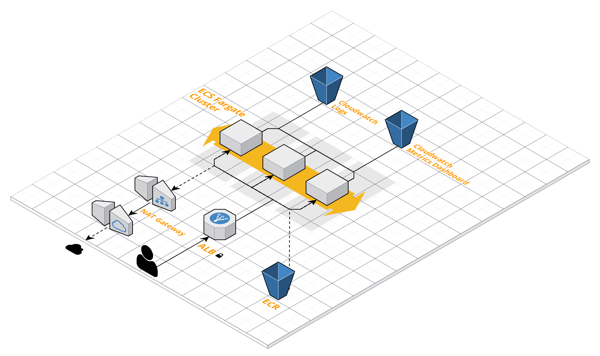
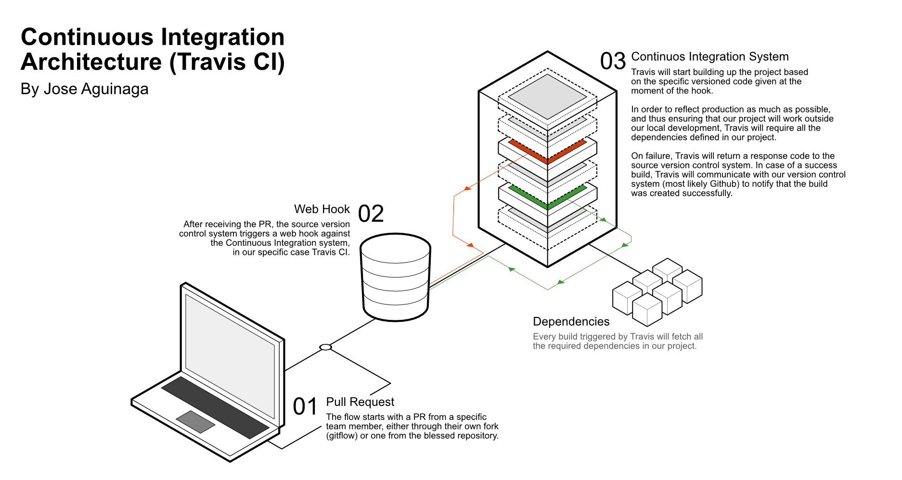

# Apresentação
> Sinta-se à vontade para criar em cima do problema abaixo. Caso algo não esteja claro, pode assumir o que seja mais claro para você e indique suas suposições em documentação. A especificação é bem básica e, portanto, caso deseje evoluir a ideia seguindo essa base, fique à vontade: por exemplo, utilizar composição de containers, usar ferramentas para facilitar a geração da imagem do container, etc.

## Sobre
Este Projeto se baseia em uma execução simples de API REST em python para realização de chamadas e valores mantidos podem ser consultados por consultas HTTP. Vimos essa aplicação de um modo não só interativo mais que pode ser utilizado em diversas frentes com relação a comunicação e status page. Por se basear em chamadas REST e a uma liguagem de facil execução e interpretação o mapeammento da evolução de plataforma foi divido entre as etapas:


Com essas etapas simples, foi construída uma stack de entrega de infraestrutura baseada em diversos pontos com relação a qualidade de software, disponibilidade e resproveitamento de código. Vamos passar por cada uma delas.

## Execucão Manual de aplicacao 
Os comandos de interação com a API são os seguintes:

* Start da app

```
cd app
gunicorn --log-level debug api:app
```

* Criando e listando comentários por matéria

```
# Fila 1
curl -sv localhost:8000/api/comment/new -X POST -H 'Content-Type: application/json' -d '{"email":"guilherme@example.com","comment":"Primeiro Post!","content_id":1}'
curl -sv localhost:8000/api/comment/new -X POST -H 'Content-Type: application/json' -d '{"email":"matheus@example.com","comment":"Parabens pelo novo post!","content_id":1}'
curl -sv localhost:8000/api/comment/new -X POST -H 'Content-Type: application/json' -d '{"email":"guilherme@example.com","comment":"Obrigado, irei postar neste grupo a partir de agora!","content_id":1}'

# Fila 2
curl -sv localhost:8000/api/comment/new -X POST -H 'Content-Type: application/json' -d '{"email":"gabriela@example.com","comment":"Quando sera a proxima avaliacao pessoal?","content_id":2}'
curl -sv localhost:8000/api/comment/new -X POST -H 'Content-Type: application/json' -d '{"email":"charlie@example.com","comment":"Acho que esta marcado para segunda Gabi!","content_id":2}'
curl -sv localhost:8000/api/comment/new -X POST -H 'Content-Type: application/json' -d '{"email":"gabriela@example.com","comment":"Ufa, obrigado Charlie!","content_id":2}'

# listagem matéria 1
curl -sv localhost:8000/api/comment/list/1

# listagem matéria 2
curl -sv localhost:8000/api/comment/list/2
```


## App.
Como descrito abaixo o método de consulta com relação a aplicação é basicamente o POST de um novo comentário e a consulta do mesmo. Porém isso não inibe a forma como código estará disponibilizado e para nós voltados a Infra, termos escalabilidade e precisão a cada passo que a aplicação realiza.

## Build Image.
Pensando em emcapsular uma aplicação de forma integra e mantendo os componentes intactos o docker foi a solução mais rápida e simples de disponibilizarmos a aplicação aonde quer que ela esteja. Isso quer dizer que em qualquer com disponibilidade de execução de containers esta imagem será executada da mesma forma.

## Dockerfile.
```dockerfile 
#Base Image from Python Alpine ~95.1MB
FROM python:3.6.4-alpine3.7

#Environment Mapping
WORKDIR /app
ADD     ./app /app
COPY    ./app/requirements.txt /etc

#Deployment App!
RUN     pip install -r /etc/requirements.txt
EXPOSE  8000:8000
CMD     ["gunicorn" , "-b", "0.0.0.0:8000", "--log-level", "debug", "api:app"]
```
Dockerfile é a base inicial para criação e postagem de imagem com aplicação, parametros de inicialização "CMD" são passados diretamente em imagem, automatizando sua inicialização :) 

## Playground Development.
Chamamos de Playgroud uma área onde o teste do seu build é realizado com seguranca a partir de um CI definido como delivery do código.
Tal etapa é onde desenvolvemos **e testamos** toda entrega da infraestrutura e como ela será disponibilizada posteriormente. Tal etapa envolve a entrega da infra como código e pipeline de teste automatico do mesmo. Especificacoes de CI utilizado seram abordadas posteriormente.

## Push image.
A definição de como e onde seria feito o armazenamento de imagem criada foi pensada em menos etapas de postagens e ferramentas se integrem facil e se possivel centraliza-las. Pensando nisso, o processo de push é feito para Cloud Privada na AWS, sendo que em etapa seguinte a consulta entre repositório e aplicação é mais rapida por estarem em mesma provider.

Funções dentro de .travis.yml realizam a criação de repositório privado, a tag de imagem e o push para Registry:

```yaml
- aws ecr create-repository --repository-name guilhermerenew/python-app --image-tag-mutability IMMUTABLE --region eu-west-3
- aws ecr get-login-password --region eu-west-3 | docker login --username AWS --password-stdin 417311404467.dkr.ecr.eu-west-3.amazonaws.com
- docker build -t guilhermerenew/python-app .
- docker tag guilhermerenew/python-app:latest 417311404467.dkr.ecr.eu-west-3.amazonaws.com/guilhermerenew/python-app:latest
- docker push 417311404467.dkr.ecr.eu-west-3.amazonaws.com/guilhermerenew/python-app:latest
```

## Running Application
O Provisionamento de toda a Infraestrutura foi pensada em disponibilidade e escalabilidade que aplicação pode sofrer. Tento em consideração diversos métodos de provisionamento foi escolhido o Terraform por questão de ser multi-cloud, atender mais de 90% dos recursos AWS e GCP e pela maturidade que **time todo** alcança com a implantação por tal linguagem.

## Arquivos .tf traz uma função ou recurso dentro do provider escolhido:
alb.tf              - Definição de LoadBalancer e Target Group. \
autoscaling.tf     - Auto Escalonamento de containers ECS \
ecs.tf              - Definições de container \
logs.tf             - Métricas CloudWatch! \
network.tf          - Definições de subnet priv/pub \
outputs.tf          - Assim que finalizamos o nosso deployment é retornado o DNS publico para acesso! \
provider.tf         - Qual Provider iremos provisionar os recursos descritos \
roles.tf            - Politicas de IAM \
security.tf         - Security Groups que definimos ter acesso a aplicação \
versions.tf         - variavel de versão do terraform \
variables.tf        - Definições de variaveis Globais

## Diagrama de Aplicacao Amazon ECS fargate


# TravisCI


Desde etapa de build a execução dos arquivos terraform cada uma dessas etapas são descritas em arquivos .travis em diretório raiz do repositório. TravisCi funciona definindo as etapas que deseja executar a cada PR ou commit em direcão a master que é realizado, ou seja assim que um novo PR for aberto TravisCI entendi tal situação e inicia as tarefas definidas.
TravisCI traz informacoes muito mais conclusivas sobre a saude dos commits realizados, e mapea exatamente os trackings do pipelina realizado.

1. As Credenciais fornecidas em arquivos em CI são volateis e ja se encontram redefinidas, servindo apenas como referencia e exemplo a serem realizados tanto em configuracoes de infra como as de notificacoes;
2. Não é de boa pratica a inserircão de credenciais do provider utilizado direto em código, utilize o arquivo de variaveis de ambiente para carregar suas credenciais;
3. O Travis mapeia não só informacaões basicas dos commits realizados mais tambem métricas de tempo de execucao do seu pipeline e a saude do código em branch master.



# Sobre (Teste Engenheiro de Software/DevOps Elo7)
## Itens que devem ser persistentes

Os pontos lincados em teste apontavam a criacao de uma API onde eu contesse toda essas informacoes de forma acessiveis e de facil entendimento do time atuante. 
Busquei algo que fosse integrado ao desenvolvimento de código como um todo, sem ser algo apartado. Acredito que uma feita a parte desviaria totalmente o foco no desenvolvimento dos produtos e integrar esses requisitos dentro do seu padrào de desenvolvimento de traz muito mais altonomia e evolucao como plataforma.
Os requisitos de entrega passavam por esses cinco checks que deveriam existir:

- Componente: Todos os componentes passam por uma fase de implantacao dentro do pipeline criado, logo todas as informacões de mudancas devem ser persistidas em cada um destes pipelines. - Versão: Acompanha o componente com relacão a oque esta sendo alterado.
- Responsavel: Tento todo um pipeline de entrega do código feito, as alteracoes ja acompanham o responsavel por aquela mudanca, onde é simples analisar os passos tomados. - Data: mudancas seguem uma cronologia de tempo de implantacao, tendo mapeado todos estas mudancas, a data se mantem pertinente.
- Status: É necessário um status atual do código disponibilizado, com isso o status build esclare a seguranca do pipeline realizado e se esta apto a execucao. :student:

> **Vamos avaliar o código gerado, como sua aplicação será executada e como você preparou o ambiente para que ela possa executar. O último item é muito importante e terá um peso considerável na avaliação.**

Toda construcão desde o build de imagem docker ao escalonamento de containers ECS em provider AWS é escrito em terraform e esta publicado neste repositório, os templates utilizados, as configuracoes de auto-scaling e os resources definidos para a aplicacao. Foram escitas técnicas de monitoracao a partir do auto-scaling criado, onde é aproveitado ao máximo a forma como lidamos com aplicacoes em nuvem. 

### Aprendizados e Vivências com novas tecnologias utilizadas
- [x] AWS foi escolhida como provider por maior convivência com plataforma. 
- [x] Terraform tem a modularidade de execução em mais de 95% dos recursos em nuvem.
- [x] TravisCI.
- [x] AWS Elastic Container Registry.
- [x] A partir de auto-scaling ocorre a geracao de métricas CloudWatch.
